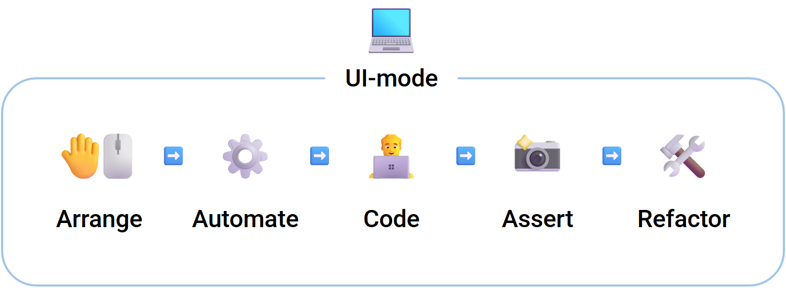
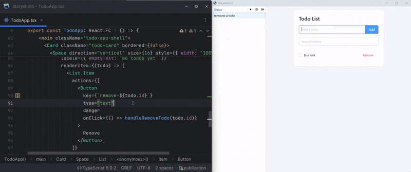
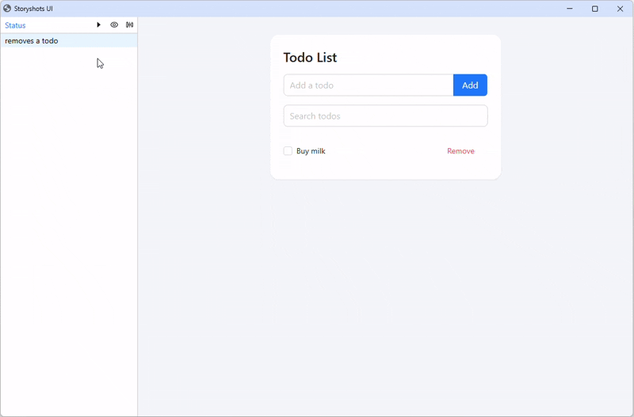

<p align="center">
  
  <a href="LICENSE"></a>
  <a href="https://storyshots.github.io/storyshots/"></a>
</p>

<p align="center">
  
</p>

<h1 align="center">Storyshots</h1>

Storyshots is a golden-master (characterization) testing toolkit for web applications built on top of Playwright.

It helps frontend teams lock user-visible behavior without coupling tests to implementation internals, making refactors safer and regression feedback faster.

Storyshots provides:
- an interactive UI mode for developing and debugging tests and features
- visual and behavioral baselines
- adapters for React and Next.js applications
- utilities for deterministic mocking and state setup

Learn more in the [documentation](https://storyshots.github.io/storyshots/).

## UI Mode First

UI mode is the main feature of Storyshots: an interactive Chromium-based development environment that automatically reproduces application state, runs scenario actions, and validates behavior snapshots.



In UI mode, developers:

* 🤚🖱️ Interact with the app as usual:
* ⚙️ Automate interactions by turning them into reusable stories:
* 👨‍💻 Develop and debug without leaving the same environment:
* 📸 Capture behavior baselines (screenshots + journals)
* 🛠️ Refactor safely with fast regression feedback

### Replay stories during development

Stories continuously restore application state for you, allowing development and debugging inside the same reproducible environment.



### Approve and validate behavior baselines

Storyshots compares current behavior snapshots (screenshots + journals) against approved baselines and immediately highlights regressions.



## Why Storyshots

- Interactive UI mode as an actual development environment, not just a test runner
- Playwright-powered execution for realistic browser behavior
- Visual and journal baselines for golden-master regression checks
- Declarative and minimal test API (`arrange` + `act`)
- Ready-to-use patterns and practices for maintainable test suites
- Adapted for hybrid applications (SSR + CSR) and pure SPA projects

## Minimal API

Stories describe:
- how application state is prepared (`arrange`)
- how the user interacts with the UI (`act`)

Storyshots then executes the scenario, captures behavior snapshots, and compares them with approved baselines.

```tsx
import { it, finder } from '@storyshots/core';

export const stories = [
  it('allows user login', {
    arrange: (externals, journal) => ({
      ...externals,
      getUser: async () => ({ id: 1, name: 'John Doe' }),
      login: journal.asRecordable(async () => ({ ok: true })), // <- login calls are now recorded
    }),
    act: (actor) =>
      actor
        .fill(finder.getByLabel('Email'), 'john@example.com')
        .fill(finder.getByLabel('Password'), 'secret')
        .screenshot('FormFilled') // <- Intermediate screenshots can be defined anywhere
        .click(finder.getByRole('button', { name: 'Sign in' })),
  }),
];
```

A passing run means the resulting behavior snapshot (screenshots + journal) matches the approved baseline for this story.

For full setup and API surface, see [Installation](https://storyshots.github.io/storyshots/installation) and [API docs](https://storyshots.github.io/storyshots/API/).

## Why Not X?

| Approach | Great at | Tradeoff | Where Storyshots fits |
| --- | --- | --- | --- |
| Playwright e2e (raw) | Browser automation and broad end-to-end coverage | Low-level primitives; you assemble your own behavior-baseline workflow | Storyshots wraps Playwright into an opinionated golden-master workflow with interactive UI mode |
| Storybook | Component-focused UI development and documentation | Component-oriented workflows do not target full app behavior regression by default | Storyshots targets visual app regression and provides an interactive environment for app development, not component-oriented development |
| Unit tests | Fast feedback on isolated logic | Weak signal for real UI behavior; often coupled to implementation details | Storyshots verifies user-visible behavior and interaction outcomes |
| Visual regression-only tools | Pixel diff checks | Image-centric workflows with limited behavioral context | Storyshots combines visual diffs with journaled interaction/system behavior |

## Learn More

- Learn more: [storyshots.github.io/storyshots](https://storyshots.github.io/storyshots/)
- Installation: [storyshots.github.io/storyshots/installation](https://storyshots.github.io/storyshots/installation)
- UI Mode: [storyshots.github.io/storyshots/ui](https://storyshots.github.io/storyshots/ui/)
- Examples: [github.com/storyshots/storyshots/tree/master/examples](https://github.com/storyshots/storyshots/tree/master/examples)
- API: [storyshots.github.io/storyshots/API](https://storyshots.github.io/storyshots/API/)
- Specification: [storyshots.github.io/storyshots/specification](https://storyshots.github.io/storyshots/specification/)
- Patterns: [storyshots.github.io/storyshots/patterns](https://storyshots.github.io/storyshots/patterns/)
