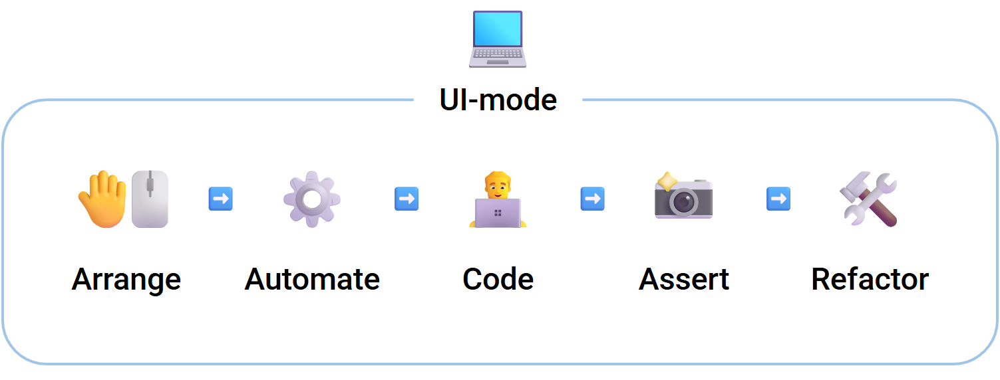

# Об инструменте

Тесты веб-приложений довольно часто оказываются в одном из трёх состояний:

- **они либо бесполезны**
- **либо слишком дороги в поддержке**
- **либо на них просто не остаётся времени**

Популярные схемы тестирования также имеют свои недостатки:

- **unit-тесты** легко писать, но они не видят реального UI-поведения и часто оказываются слишком привязаны к внутренней структуре
- **e2e-тесты** дают уверенность, но медленные, хрупкие и часто выходят за зону контроля FE-команды
- **компонентные тесты** выглядят как компромисс, но на практике нередко наследуют недостатки обоих подходов

В итоге тесты живут отдельно от разработки, а разработка — отдельно от тестов.

## Что такое storyshots

`storyshots` **делает тесты главным инструментом разработчика**.

Это фреймворк и набор практик для *test-assisted* разработки веб-приложений, где тест **не пишется после**, а **возникает прямо в процессе разработки**.

  
Это TDD?

  
TDD ориентируется на написание теста <b>до</b> рабочего кода, а не <b>вовремя</b>, как это происходит в <code>storyshots</code>.

  <blockquote>Однако, <code>storyshots</code> поддерживает разные практики тестирования, в том числе и TDD</blockquote>

### Взаимодействие с UI

Обычный процесс разработки выглядит так:
1. Мы запускаем dev-сервер
2. Открываем приложение в браузере
3. Переходим на нужную страницу
4. Вручную приводим UI в нужное состояние (заполняем формы, кликаем списки, выполняем цепочку действий)
5. Только после этого начинаем писать код.

При любом изменении исходников приложение перезапускается — и всё состояние, набитое вручную, теряется.

Разработчику приходится снова и снова воспроизводить **один и тот же сценарий**.

  
А как-же HMR?

  
Существуют механизмы частичного сохранения состояния (например HMR), но они не гарантируют корректную работу в комплексных кейсах или гибридных окружениях (CSR + SSR, изоморфный код, побочные эффекты).

  
К тому же <code>storyshots</code> не исключается HMR, а <b>дополняет</b> его.

`storyshots` превращает этот ручной труд в **историю** — воспроизводимый, детерминированный UI-сценарий, который можно:

- воспроизводить
- останавливать
- изменять
- и использовать как **окружение разработки**

Ключевую роль здесь играет **UI-режим**.

## Тест, в котором можно разрабатывать

[**UI-режим**](/ui/) - одна из ключевых особенностей `storyshots`:

В нём разработчик:
* 🤚🖱️ **взаимодействует** с приложением как обычно
* ⚙️ **автоматизирует** действия, превращая их в историю
* 👨‍💻 **разрабатывает и отлаживает** код как в привычном браузере
* 📸 **фиксирует** целевое поведение
* 🛠️ **рефакторит** реализацию без опасений что-то сломать

**Тест и поведение создаются одновременно и неотделимы друг от друга.**

> Тесты больше не откладываются «на потом» — они естественным образом появляются вместе с новыми фичами.

В UI-режиме также можно:

* 👀 наблюдать выполнение теста в реальном времени
* ⏸️ останавливать сценарий и продолжать разработку с текущего состояния
* 📱 эмулировать разные устройства
* ⚡ быстро воспроизводить сложные окружения и состояния

:::info
UI-режим - это **улучшенный** браузер для веб-разработчика, а не просто раннер тестов.
:::

## Верификация поведения, а не реализации

`storyshots` проверяет приложение с помощью техники [golden master](https://en.wikipedia.org/wiki/Characterization_test).

Верификации выполняются в **автоматическом** режиме, разработчику требуется лишь указать **что** и **когда** необходимо
зафиксировать.

:::note
Специальные *паттерны* и *инструменты* `storyshots` были разработаны для того, чтобы существенно увеличить
поддерживаемость эталонного тестирования именно в разрезе UI.
:::

:::tip Важно
`storyshots` верифицирует **не реализацию**, а **то, что реально видит и получает пользователь**, а также любые **взаимодействия**
с внешними системами, которые вы считаете важными.
:::

## Стабильность на архитектурном уровне

`storyshots` на [архитектурном уровне](/specification/scheme) обеспечивает **закрытость тестов от деталей реализации**, что в свою очередь:

* Дополнительно усиливает **защиту от регресса**.
* Позволяет разработчикам осуществлять даже самый **глобальный рефакторинг** кодовой базы.
* Даёт интегрировать `storyshots` даже в **долгоживущие проекты** с объёмной кодовой базой.

## Почему storyshots

- 💻 **UI-режим** - единая среда разработки и тестирования.
- 🛡️ **Полноценные тесты** - легко писать, надёжно защищают от регресса.
- 🚀 **Минимум тестового кода** - проще поддерживать и развивать.
- 📝 **Живая документация** - генерируется автоматически.
- 🔗 **Простота интеграции** - подходит даже для зрелых и больших проектов.
- 💯 **Всё включено** - от готовых решений до проверенных паттернов и рекомендаций.

:::note
`storyshots` не заменяет unit- или e2e-тесты, а закрывает пространство между ними — там, где важно реальное поведение
UI, быстрый feedback и свобода изменений.
:::

## Кому подойдёт

- командам, выбирающим стратегию тестирования на старте
- командам с активной UI-разработкой и частым рефакторингом
- проектам с долгоживущим frontend-кодом
- приложениям с гибридным runtime (например, Next.js)

## Начало работы

- ⚡ **Быстрый старт** — [Установка](/installation), [UI-режим](/ui/) и [примеры проектов](https://github.com/storyshots/storyshots/tree/master/examples)
- 📘 **Глубокое погружение** — [спецификация](/specification/), [API](/API/) и [паттерны](/patterns/)
