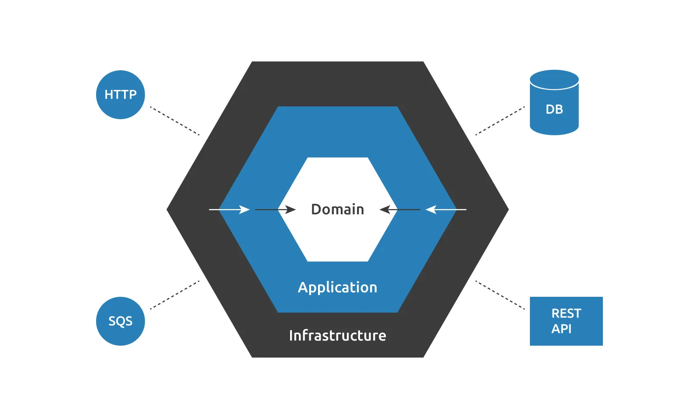

import { Diagram } from '@site/src/Diagram';

# Анализ

Данная модель предназначена для тестирования систем с конечным и наблюдаемым поведением.

<Diagram src={require('./assets/test-arch.drawio.png')} />

Модель применима к следующим классам систем:

- **FE-компонент** приложения, где BE выносится за границы AUT.
- **Full-stack** приложение, где за границы выносятся обращения к внешним сервисам и системным службам.
- **Web-сервис**, где события *пользователя* заменяются обычным обращением к API, а *монитор* становится слепком ответа от
  методов.
- **Util-библиотека** — в случае своей изолированности, остаются только обращения к функциям и слепки их результатов.

Однако, её основной фокус — это системы с конечным и наблюдаемым поведением.

## Границы тестирования

:::info Важный факт
Границы тестирования определяются клиентами тестируемого компонента.
:::

Разберём на примерах подробнее.

#### FE-компонент

Клиенты:

* Пользователь системы:
  * Вход: события взаимодействия.
  * Выход: визуальное представление UI.
* BE и внешние сервисы:
  * Вход: запросы от AUT.
  * Выход: данные, возвращаемые из AUT.

#### Util-библиотека

Клиенты:

* Пользователь API:
  * Вход: вызовы методов.
  * Выход: возвращаемые значения.

Изменение стека не изменяет модель. Изменяется только расположение границ тестирования.

## Гибкость тестирования

Возьмём к примеру Web-сервис. При тестировании API справедливо может возникнуть вопрос, что делать с БД? В текущей
модели это сводится к простому — *"БД должна быть частью AUT или лежать на границах тестирования?"*

* Если БД становится частью AUT:
  * Увеличиться защита от регресса и устойчивость к рефакторингу.
  * БД должна стать внутренним состоянием AUT.
* Если БД выходит за границы AUT:
  * Уменьшается защита от регресса, но вырастает быстродействие.
  * Взаимодействие с БД осуществляется по контракту через внешний слой.

Описываемая модель тестирования не уходит в конкретику — она описывает возможные варианты и помогает оценить их
последствия.

## Защита от регресса

#### Свойства

* Недетерминированные операции локализованы в слое внешних запросов.
* Основная логика сосредоточена внутри AUT.
* Наблюдаемое поведение фиксируется через:
  * слепки UI;
  * зафиксированные команды взаимодействия с внешними системами.

#### Ограничения

Модель не предназначена для выявления расхождений между AUT и **реальными** внешними системами.

Проверяется корректность взаимодействия AUT с **моделью внешнего мира**, заданной **контрактами интерфейсов**.

## Устойчивость к рефакторингу

Решение является устойчивым к изменению **деталей реализации AUT**, за исключением:

* Изменение реализации пользовательского интерфейса.
* Изменение контрактов взаимодействия с внешней средой.

Изменения UI компенсируются использованием семантических селекторов.

Изменения контрактов внешней среды частично решаются использованием специальных паттернов: адаптер, фасад и другие.

Источники хрупкости **локализованы на границах системы**.

## Поддерживаемость

#### Свойства

* Верификация поведения полностью автоматизирована.
* Тесты описывают только входные данные и сценарии.
* Архитектурное требование: явное или неявное выделение портов ввода и вывода.

Допустимые способы интеграции:

* Явное разделение I/O через инверсию зависимостей.
* Неявная подмена поведения через сайд-эффекты (monkey‑patching).

#### Ограничения

Основной объём тестового кода приходится на:

* описание пользовательских сценариев;
* описание моделей внешних API.

С ростом сложности внешних контрактов возрастает сложность тестов.

:::tip
По этой причине в данном руководстве были описаны специальные [паттерны](/patterns/) работы с данной категорией данных.
:::

## Быстродействие

#### Свойства

* Отсутствие внешнего состояния.
* Возможность параллельного выполнения тестов.

#### Ограничения

Рост покрытия увеличивает время выполнения тестов.

## Вывод

Описываемая модель тестирования представляет тестируемое приложение в виде знакомой гексагональной архитектуры:

* На границах системы располагается тонкий слой взаимодействия с внешней средой приложения: БД, устройства, веб-сервисы, Runtime API и прочее.
* Ядро же включает в себя всё остальное.

Выделяются конкретные категории внешних *портов*: входящих данных и исходящих сайд-эффектов. Таким образом ядро становится функцией от входящих данных. Её результатом становятся сайд-эффекты на внешний мир.

За счёт fp-like моделирования, на данную структуру хорошо укладываются тесты и это не *просто совпадение*, а следствие
простого факта — тесты это **ещё один пользователь системы**. Нюанс заключается в том, что этот пользователь работает с
тестируемым приложением не в целевом окружении, а *изолированном*.

Изоляция обеспечивает:
* детерминизм;
* управляемость;
* воспроизводимость;
* высокую скорость выполнения.

Ограничения модели:
* сниженная защита от регресса по сравнению с e2e‑тестами;
* необходимость описания внешней среды в тестах.

Модель является компромиссным решением при тестировании компонентов системы в изоляции, когда использование e2e не
является целесообразным.
