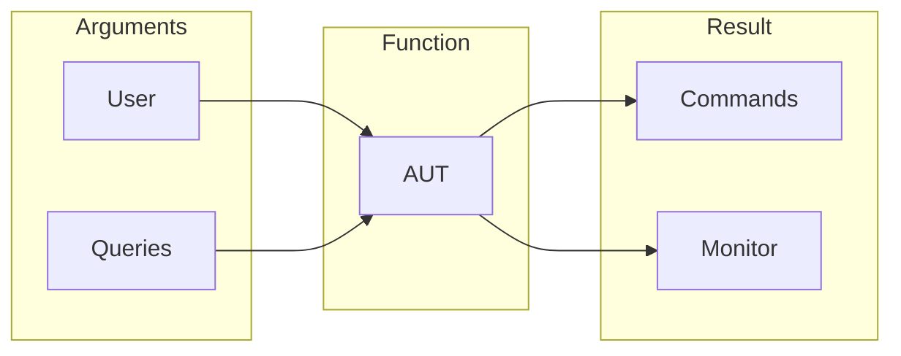

# Analysis {#analysis}

This model is designed for testing systems with finite and observable behavior.

```mermaid
flowchart LR
  subgraph A["Arguments"]
    direction TB
    U["User"]
    Q["Queries"]
  end

  subgraph F["Function"]
    direction TB
    AUT["AUT"]
  end

  subgraph R["Result"]
    direction TB
    C["Commands"]
    M["Monitor"]
  end

  U --> AUT
  Q --> AUT
  AUT --> C
  AUT --> M
```

The model applies to the following classes of systems:

- **FE-component** of an application, where BE is moved outside the AUT.
- **Full-stack** application, where interactions with external services and system services are moved outside.
- **Web-service**, where user events are replaced with standard API calls, and the **Monitor** becomes a **baseline** of responses from methods.
- **Util-library** — in case of isolation, only function calls and **baseline** results remain.

However, its primary focus is on systems with finite and observable behavior.

## Testing Boundaries {#testing-boundaries}

:::info Important fact
Testing boundaries are defined by clients of the component being tested.
:::

Let’s examine this in more detail with examples.

#### FE-component {#fe-component}

Clients:

* System user:
  * Input: interaction events.
  * Output: visual UI representation.
* BE and external services:
  * Input: queries from AUT.
  * Output: data returned by AUT.

#### Util-library {#util-library}

Clients:

* API user:
  * Input: method calls.
  * Output: returned values.

Changing the stack does not alter the model — only the location of testing boundaries changes.

## Testing Flexibility {#testing-flexibility}

Take a web service as an example. When testing the API, a common question arises: what to do with the database? In the current model, this reduces to a simple question — *"Should the database be part of the AUT or lie on the testing boundaries?"

* If the database becomes part of the AUT:
  * Regression protection increases and resilience to refactoring improves.
  * The database must become internal state of the AUT.
* If the database lies outside the AUT:
  * Regression protection decreases, but performance increases.
  * Database interaction occurs via contract through an external layer.

The described testing model does not go into specifics — it outlines possible options and helps assess their consequences.

## Regression Protection {#regression-protection}

#### Properties {#properties}

* Non-deterministic operations are localized in the external request layer.
* Core logic is concentrated inside the AUT.
* Observable behavior is captured through:
  * UI **baselines**;
  * recorded interaction commands with external systems.

#### Limitations {#limitations}

The model is not intended to detect discrepancies between the AUT and **real** external systems.

It verifies the correctness of AUT’s interaction with the **model of the external world**, defined by **interface contracts**.

## Refactoring Resilience {#refactoring-resilience}

The solution is resilient to changes in the **implementation details** of the AUT, except for:

* Changes in the user interface implementation.
* Changes in contracts for interaction with the external environment.

UI changes are compensated by using semantic selectors.

External contract changes are partially addressed using special patterns: adapter, facade, and others.

Sources of fragility are **localized at system boundaries**.

## Maintainability {#maintainability}

#### Properties {#properties}

* Behavior verification is fully automated.
* Tests describe only input data and scenarios.
* Architectural requirement: explicit or implicit separation of input and output ports.

Acceptable integration approaches:

* Explicit I/O separation via dependency inversion.
* Implicit behavior substitution via side effects (monkey-patching).

#### Limitations {#limitations}

The majority of test code is devoted to:

* describing user scenarios;
* describing models of external APIs.

As external contracts grow in complexity, test complexity increases.

:::tip
For this reason, special [patterns](/patterns/) for working with this type of data are described in this guide.
:::

## Performance {#performance}

#### Properties {#properties}

* No external state.
* Tests can be executed in parallel.

#### Limitations {#limitations}

Increased coverage leads to longer test execution time.

## Conclusion {#conclusion}

The described testing model represents the tested application in a familiar hexagonal architecture:

* The outer layers contain a thin interaction layer with the application's external environment: databases, devices, web services, Runtime API, etc.
* The core includes everything else.

Specific categories of external *ports* are identified: incoming data and outgoing side effects. Thus, the core becomes a function of incoming data, with results being side effects on the external world.

Thanks to the fp-like modeling, this structure fits well with testing — this is not *just a coincidence*, but a consequence of a simple fact: tests are **another user of the system**. The nuance is that this user interacts with the tested application not in the target environment, but in an **isolated** one.

Isolation provides:
* determinism;
* manageability;
* reproducibility;
* high execution speed.

Model limitations:
* Reduced regression protection compared to e2e tests;
* Need to describe the external environment within tests.

The model is a compromise solution for testing system components in isolation, when using e2e testing is not practical.
