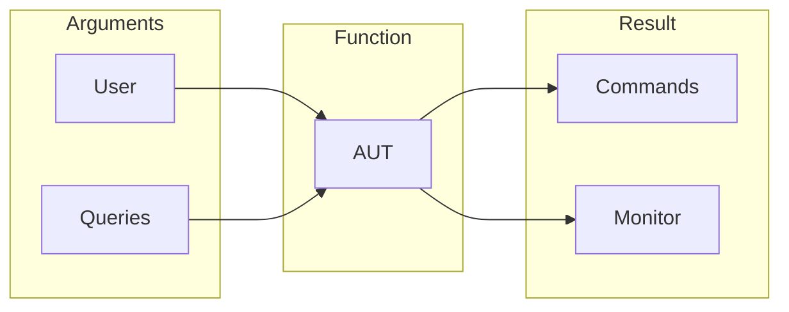
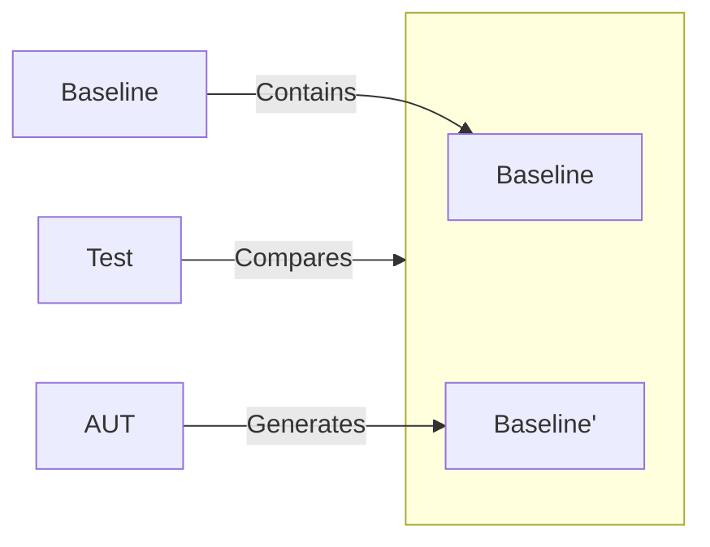

# Test Boundaries {#test-boundaries}

Let's start by noting that any test scenario can be divided into three main stages:

1. **Input preparation**: initializing arguments for the program under test.
2. **Function execution**: interacting with the program to obtain its output.
3. **Verification**: checking the resulting output against established conditions.

Using these stages, we can define what are known as _test boundaries_.

## Defining Boundaries {#define-boundaries}

Any application can be modeled in the following way:

:::note
Arrows on the diagram indicate the direction of information flow.
:::

### Arguments {#arguments}

Data entering the application. Consists of two components:

- **User**: user events (e.g., mouse clicks, key presses).
- **Queries**: implicit incoming data (e.g., web services, local storage).

### Result {#result}

The outcome of the application's execution. Includes:

- **Monitor**: the user interface displayed to the user.
- **Commands**: implicit outgoing data (e.g., database updates, turning on a phone flashlight).

### Function {#function}

The component that transforms inputs into outputs. Represented by the AUT (application under test) block and is the primary object of testing.

To increase protection against regressions, it is recommended to include as much functionality as possible within the testable AUT block. This is achieved by **simplifying and minimizing the remaining sections**, namely inputs and outputs.

:::note Zero-sum
The sections are interconnected, as they form a single program. Therefore, increasing the size of one section will lead to a reduction in the size of the others.
:::

## Verification {#verification}

The verification model of behavior looks as follows:

Where:

- **Baseline** — an artifact of AUT behavior, represented as a _value_.
- **Golden Master** — a repository containing the baseline of the _expected_ application behavior.

This model uses the popular testing technique known as [golden master](https://blog.thecodewhisperer.com/permalink/surviving-legacy-code-with-golden-master-and-sampling).

:::note
It should be noted that this model does not prove the _correctness_ of the program in the conventional sense. It merely helps detect deviations in AUT behavior.

However, regression is a specific case of deviation, so this is sufficient.
:::

**Advantage** of this method lies in its simplicity: managing the golden master and verification can be easily automated.

But this technique comes at a high cost:

- **Well-defined inputs** — inputs must be clearly tied to specific test scenarios.
- **Determinism** — both the application and its execution environment must be deterministic.
- **First-class output** — the AUT output must be something that can be *recorded* into the golden master and *compared*.

The foundation is laid — test boundaries clearly separate inputs, outputs, and the application itself.

The rest is technical detail: go through each layer and set the necessary properties for each component individually.

  
Implementation of boundaries in `storyshots`

  

    `storyshots` combines layer management into a single entity — a story, where:
    - **Inputs** are described in `act` and `arrange` functions.
    - **AUT** is executed in the `render` function.
    - **Output** is the UI snapshots and program side-effect logs.
  

