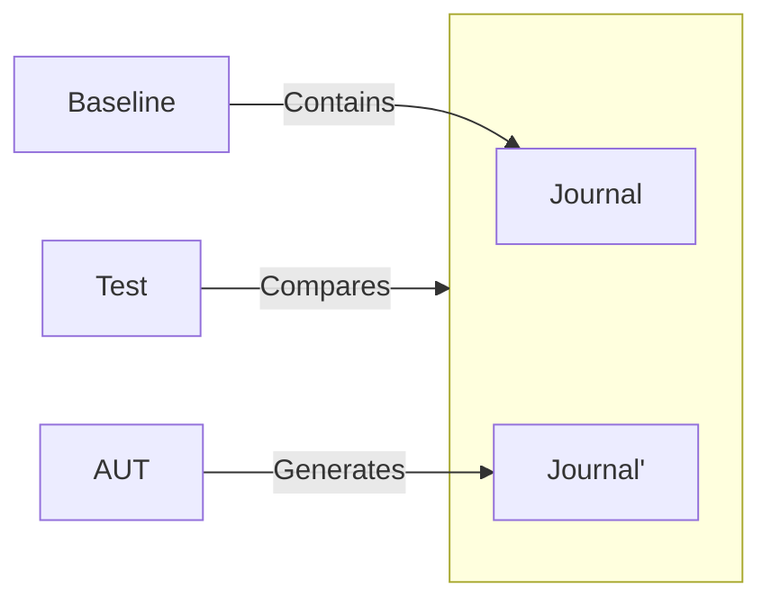

import { BalancedMetricsTip, Metric } from '@site/src/MetricsTip';


# Commands {#commands}

<BalancedMetricsTip
  improves={[Metric.RegressionProtection, Metric.Maintainability, Metric.Speed]}
/>

Commands include _implicit_ outgoing data from the application — the results of its execution observable beyond the AUT. This relates to the [_outcome_](/specification/requirements/borders#define-boundaries) section.

## Side-Effect {#side-effects}

A side-effect is a _visible_ result of a function's execution, existing _beyond_ its return value.

:::note
In the context of this specification, when referring to a "function," we mean the AUT — the entire program that needs to be made _testable_.

Thus, a side-effect is a result of the AUT's execution that extends beyond the _testable program_ itself.
:::

<details>
  <summary>Is `throw new Error()` a side-effect?</summary>
  <p>
    Consider a simple division function:
    ```ts
    function divide(a: number, b: number): number {
      if (b === 0) {
        throw new Error('Cannot divide by zero');
      }

      return a / b;
    }
```

    * It cannot be said that the thrown exception is the function's return value: it cannot be assigned to a variable and requires special handling.
    * Moreover, looking only at the signature `function divide(a: number, b: number): number`, it's impossible to determine which exceptions are thrown, or if any are thrown at all.

    Now let's examine an alternative version:

    ```ts
    function divide(a: number, b: number): Either<number, CanNotDivideByZero> {
      if (b === 0) {
        return left(new CanNotDivideByZero())
      }

      return right(a / b);
    }
```

    * Now the error is explicitly returned from the function as a value.
    * The signature makes the function transparent, indicating the possibility of an exception.

    This contrast clearly shows that exceptions are side-effects. However, since they do not leave the AUT, they are not considered commands in the context of testing.
  </p>
</details>

## External Environment {#external-environment}

The definition is easiest to understand through the following example:

```ts
declare function getUsers(): Promise<User[]>;
declare function addUser(body: UserBody): Promise<User[]>;

/**
 * The getUsers function returns a list of users from the database.
 *
 * On the first run, the list is empty, as users have not yet been added.
 */
await getUsers(); // []

/**
 * The addUser function adds a new user to the database, returning nothing.
 */
await addUser({ name: 'Vasiliy' });

/**
 * On subsequent calls, getUsers returns a different result.
 *
 * The addUser function changed the external state, which affected the behavior of getUsers.
 */
await getUsers(); // [{ id: 1, name: 'Vasiliy' }]
```

- `addUser` returns `void` as its result.
- Yet, `addUser` performs an action that affects the behavior of an external client — the `getUsers` function.

Besides simple commands, there are functions that perform both side-effects and return a result:

```ts
// Scans a barcode from the device's camera
const code = await scanBarCodeWithCamera();

// Queries permissions from the user
const granted = askForPermissions(permisions);

// Vibrates the phone, throws an exception on failure
vibratePhone();

// Shows a system confirmation dialog
const confirmed = window.confirm('Are you sure?');
```

All the listed functions share one important property — they all perform side-effects in the *external environment*.

:::note
The external environment refers to data living beyond the AUT. A side-effect modifies this data, which in turn may make the AUT's behavior non-deterministic.
:::

## Verification Method {#verification-method}

According to the established verification conditions, it is necessary to:

- Express side-effects as values, so they can be recorded in the baseline.
- Avoid executing side-effects in the test environment to ensure control.

This is achieved through a combination of _mocking_ and _logging_.

With the standard approach, the command implementation loses its side-effects, and the call is recorded in the journal:

```ts
function showNativeNotification(config: NotificationConfig) {
  /*
   It's important to record full function information — when and with what parameters it was called,
   as this is part of the interaction contract.
  */
  journal.record('showNativeNotification', config);
  // Do nothing in tests
}

/**
 * Initially, the call journal is empty — []
 */

// ...

/**
 * When method is called, journal will record invocation by recording a function name and arguments.
 * [["showNativeNotification", [{ title: 'Hello, User!' }]]]
 */
await showNativeNotification({ title: 'Hello, User!' });

/**
 * The journal accumulates calls to such functions.
 */
```

During tests, the program calls methods and populates the journal. At the end, the journal is compared with the [baseline](/specification/requirements/borders#verification) to verify the application's correctness.

Process flow:



The journal becomes a **baseline of the AUT's side-effects**. This artifact can be used by developers to validate the _interaction contract_ with the external world.

:::note
With this model, if observed behavior is broken but the baseline journal remains unchanged, this may indicate:

- External system behavior has changed
- Interaction contracts have been altered

In both cases, the regression was caused by external changes, not by internal implementation damage.
:::

<details>
  <summary>Signals</summary>
  <p>
    A distinct category of commands can be identified — functions that perform side-effects, but whose results do not affect the AUT's operation:

    ```ts
    // This function sends a receipt by email
    const success = sendReceiptByEmail(receipt);
    ```

    The only thing the AUT processes is the success status of the side-effect execution, not its outcome. These functions can be seen as simply sending *signals* to external systems (**fire and forget**).

    Nevertheless, for testing purposes, such functions should still be treated as commands for the following reasons:

    * The journal verifies the interaction contract. Signals must be compatible with external system interfaces.
    * Signals must not be sent to external systems during testing, for control purposes.
  </p>
</details>

### Emulation {#emulation}

Another verification method for commands is emulation:

```ts
// In tests, the behavior of getUsers and addUser is emulated
const users: User[] = [];

async function getUsers(): Promise<User[]> {
  return users;
}

async function addUser(body: UserBody): Promise<User[]> {
  users.push(createUserFromBody(body));
}

async function test() {
  // Displays an empty user list
  snapshot(renderUI(await getUsers())); // []

  await addUser({ name: 'Vasiliy' });

  // Displays a list with the added user
  snapshot(renderUI(await getUsers())); // [{ id: 1, name: 'Vasiliy' }]
}
```

:::note
`addUser` still performs a side-effect relative to `getUsers`, but it **does not leave the AUT**. The program remains deterministic, and thus testable.
:::

This method provides stronger regression protection, as the external system's behavior is now emulated, bringing the AUT's operating conditions closer to the target.

However, in exchange, the test scenario becomes more complex, introducing **additional logic**.

:::tip
If the external system's behavior is trivial and the AUT is complex, prefer emulation. Otherwise, use journals.
:::

## Library Connection {#library-connection}

`storyshots` allows testing functions like `addUser` in two ways:

- Using the [call journal](/specification/requirements/command#verification-method) (recommended for most cases).
- Using [behavior emulation](/patterns/externals#emulation-externals) (increases test complexity but enhances regression protection).
- The "command" component is stored in the `externals` object and substituted via [arrange](/modules/react#arrange)