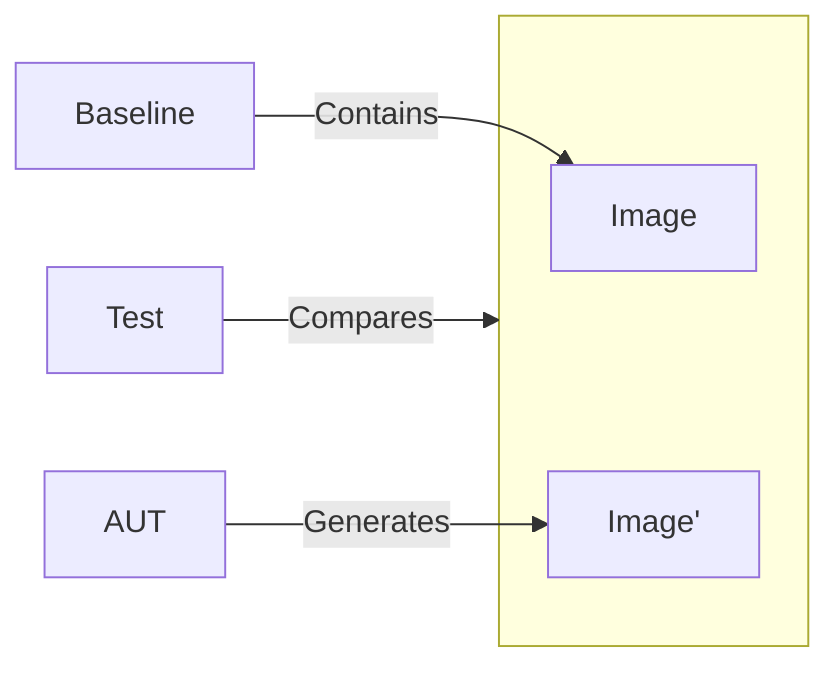

import { BalancedMetricsTip, Metric } from '@site/src/MetricsTip';

# Monitor {#monitor}

<BalancedMetricsTip improves={[Metric.RegressionProtection, Metric.RefactoringAllowance, Metric.Maintainability]} />

The Monitor includes the main output of the UI part of the application — the user interface image.
It belongs to the [*result*](/specification/requirements/borders#define-boundaries) section.

:::note
Strictly speaking, displaying the interface on the user's screen is also a side effect, just like any other output operation. However, to emphasize the nuances of operation, this specification treats UI as a separate component.
:::

## Verification {#verification}

The process flow is as follows:

## Connection with the Library {#library-connection}

`storyshots` implements an [actor](/API/test-components/actor) that combines automatic image generation via screenshots with the ability to create intermediate snapshots.
