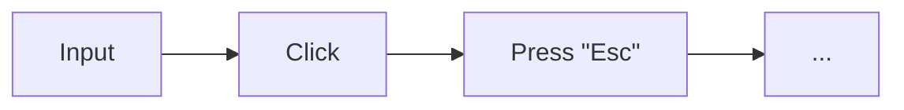

import { BalancedMetricsTip, Metric } from '@site/src/MetricsTip';

# User {#user}

<BalancedMetricsTip improves={[Metric.RegressionProtection, Metric.RefactoringAllowance, Metric.Maintainability]} />

Being part of the [*arguments*](/specification/requirements/borders#define-boundaries), this block describes the sequence of actions a user performs while interacting with the application.

Example user actions:

:::note
The "user" component must be selectable so that a specific sequence of actions can be tied to a particular baseline (result).
:::

## Connection with the library {#library-connection}

In the `storyshots` library, the [`actor`](/API/test-components/actor) and [`finder`](/API/test-components/finder) objects together represent the user — an agent capable of performing various actions on the page.

:::note
`storyshots` makes the "user" component selectable by using first-class entities (in this case, the `actor` object).
:::
