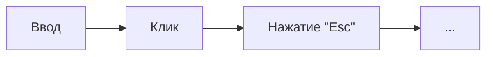

import { BalancedMetricsTip, Metric } from '@site/src/MetricsTip';

# Пользователь {#user}

<BalancedMetricsTip improves={[Metric.RegressionProtection, Metric.RefactoringAllowance, Metric.Maintainability]} />

Являясь частью секции [*аргументов*](/specification/requirements/borders#define-boundaries) данный блок описывает
последовательность действий, которые пользователь предпринимает взаимодействуя с приложением.

Пример действий пользователя:

:::note
Компонент "пользователь" должен быть выделяемым, для того чтобы взятую последовательность действий можно было закрепить
за конкретным эталоном (результатом).
:::

## Связь с библиотекой {#library-connection}

В библиотеке `storyshots` объекты [`actor`](/API/test-components/actor) и [`finder`](/API/test-components/finder) совместно представляют пользователя — агента, способного выполнять
различные действия на странице.

:::note
`storyshots` делает компонент "пользователь" выделяемым с помощью first class сущностей (в данном случае
объекта `actor`).
:::
